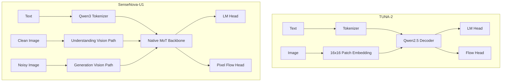

# TUNA-2 vs SenseNova-U1

两篇论文都在探索 native unified multimodal models：不再依赖传统 pretrained vision encoder，也不再依赖 VAE latent decoder。

## 高层对比

| Dimension | TUNA-2 | SenseNova-U1 |
|---|---|---|
| Main goal | Pixel embeddings beat vision encoders | Unified understanding and generation with NEO-unify |
| Vision encoder | Removed | Removed |
| VAE | Removed | Removed |
| Visual token | 16×16 pixel embedding | effective 32×32 token |
| Backbone | Qwen2.5 decoder | Qwen3-style Native MoT |
| Text output | LM head | LM head |
| Image output | flow head | pixel flow head / MLP |
| Stream decoupling | relatively simple | explicit understanding/generation MoT |
| Main novelty | pixel embeddings can work without VE/VAE | native MoT reduces objective interference |

## Forward path 对比

### TUNA-2

```text
text -> Qwen tokenizer -> embeddings
image -> Conv2d patch embedding
combined sequence -> Qwen2.5 decoder
  -> LM head
  -> flow head
```

### SenseNova-U1

```text
text -> Qwen3 tokenizer -> shared embeddings
clean image -> vision_model
noisy image -> vision_model_mot_gen + timestep/noise embedding
combined sequence -> Native MoT backbone
  -> LM head
  -> fm_head
```

## 架构图



## 训练路线对比

| Stage | TUNA-2 | SenseNova-U1 |
|---|---|---|
| Early stage | full-model pretraining | understanding warmup |
| Generation setup | joint captioning + T2I | freeze understanding, pretrain generation branch |
| Joint stage | full-model SFT | unified mid-training + unified SFT |
| Post-training | not central in notes | Flow-GRPO + distillation |

## 一个重要区别：objective interference

TUNA-2 更像在一个 Qwen decoder 上同时承载：

```text
understanding objective + generation objective
```

SenseNova-U1 认为这种异构目标可能冲突，于是使用 MoT：

```text
understanding tokens -> understanding branch params
generation tokens -> generation branch params
attention context remains native/unified
```

所以 SenseNova-U1 的核心架构问题是：

> 如何既共享上下文，又减少理解和生成目标之间的参数干扰？

## 记忆版总结

```text
TUNA-2 proves simple pixel embeddings can replace vision encoders.
SenseNova-U1 goes further by adding stream-wise MoT decoupling,
so clean understanding and noisy generation can coexist inside one native backbone.
```

