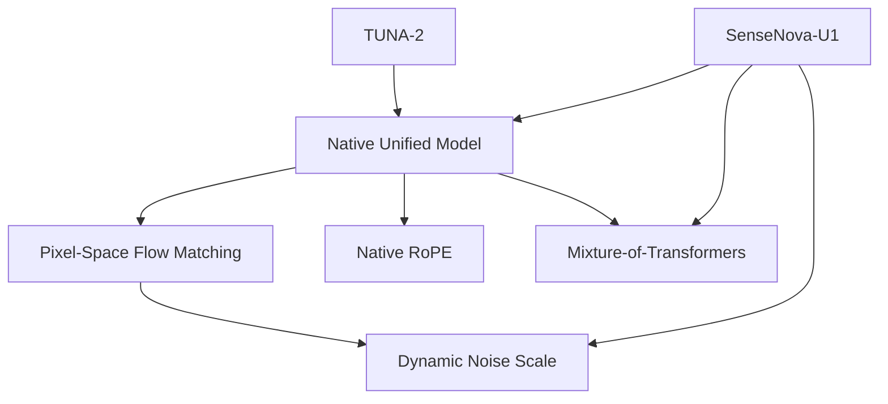

# Concept Map

这里放跨论文复用的概念。每个概念页都应该回答三个问题：

1. 它解决什么问题？
2. 它在不同论文里怎么实现？
3. 读代码时应该找哪些模块？

## 当前概念

- [Native Unified Models](native-unified-model.md)
- [Mixture-of-Transformers](mixture-of-transformers.md)
- [Pixel-Space Flow Matching](pixel-space-flow-matching.md)
- [Native RoPE](native-rope.md)
- [Dynamic Noise Scale](dynamic-noise-scale.md)

## 概念关系

