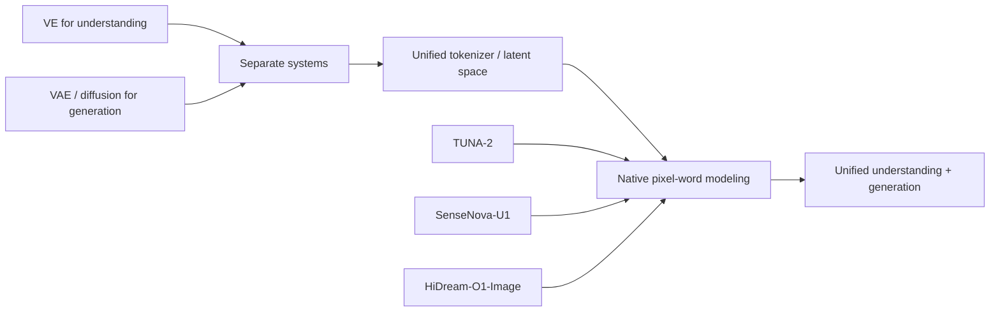

# Multimodal Paper Notes

这是一个持续维护的多模态论文读书站点。目标不是简单堆 Markdown，而是把每篇论文整理成一个可以复习、横向比较、持续扩展的研究知识库。

## 当前收录

| Paper | Topic | Status |
|---|---|---|
| [HiDream-O1-Image](papers/hidream-o1-image/index.md) | Pixel-level Unified Transformer, Qwen3-VL initialized raw-pixel generation | 第一版完整笔记 |
| [SenseNova-U1](papers/sensenova-u1/index.md) | Native unified understanding + generation, NEO-unify, MoT | 第一版完整笔记 |
| [TUNA-2](papers/tuna-2/index.md) | Pixel embeddings, VAE-free / encoder-free unified model | 已迁入 |

## 推荐阅读方式

如果是第一次读一篇论文，建议按这个顺序：

```text
Overview
  -> Model Architecture
  -> Data Construction
  -> Training Recipe
  -> Paper-Code Crosscheck
  -> Reproducibility Gaps
```

如果是在面试或复习前快速回顾：

```text
Paper index
  -> TL;DR
  -> Key Architecture Diagram
  -> Training Timeline
  -> FAQ / Crosscheck
```

## 知识库结构

```text
papers/
  每篇论文的完整精读笔记

concepts/
  跨论文复用的概念，比如 MoT、Native RoPE、Flow Matching

comparisons/
  论文之间的横向对比
```

## 当前主线：Native Unified Multimodal Models



## 后续维护模板

每加入一篇新论文，建议新增：

```text
docs/papers/<paper-name>/
  index.md
  00_overview.md
  01_model_architecture.md
  02_data_construction.md
  03_training_recipe.md
  04_paper_code_crosscheck.md
  05_reproducibility_gaps.md
```

如果这篇论文带来重要新概念，再同步加入：

```text
docs/concepts/<concept-name>.md
```

如果它和已有论文强相关，再加入：

```text
docs/comparisons/<paper-a>-vs-<paper-b>.md
```
