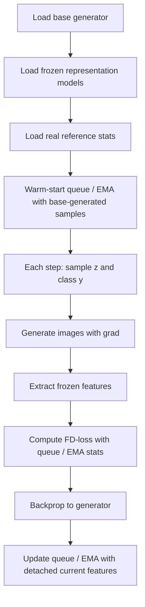

# Training Recipe

FD-loss 的训练 recipe 是 post-training。基本流程是：

```text
load pretrained generator
precompute/load real feature stats
warm-start generated feature stats
fine-tune generator with FD-loss
evaluate with 50k samples
```

## 1. 训练总体流程



## 2. 训练 step

代码 `main_fd.py` 的核心 step：

```python
z = torch.randn(batch_size, *input_shape, device="cuda") * args.noise_scale
y = torch.randint(0, num_classes, (batch_size,), device="cuda")
sampled = model_wo_ddp.sample_images_with_grad(z, y, sampling_args=sampling_args)
sampled = sampled * 0.5 + 0.5
```

然后对每个 judge / representation model：

```python
feats = extract_judge_features(judge, sampled)
new_feats = diff_all_gather(feats)
```

再用 queue 或 EMA 构建统计量，计算 FD：

```python
fid = compute_frechet_distance_loss(...)
fid_loss = fid / (fid.detach() + fid_norm_eps)
loss = loss + judge["weight"] * fid_loss
```

最后：

```python
loss.backward()
optimizer.step()
judge["queue"].enqueue(new_feats.detach())
```

注意顺序：先用当前 features 参与可微 FD，再把 detached features 写入 queue/EMA。

## 3. ImageNet post-training hyperparameters

论文 appendix 给出的 class-conditioned post-training 设置：

| Setting | Value |
|---|---|
| Optimizer | AdamW |
| Adam betas | 0.9, 0.95 |
| Weight decay | 0 |
| LR pMF / iMF | 1e-6 |
| LR JiT | 1e-5 |
| LR schedule | cosine |
| Warmup | 5 epochs |
| Global batch size | 1024 |
| Precision | bf16 |
| Gradient clipping | none |
| Model-weight EMA | none |
| Augmentation | center crop, horizontal flip |
| Ablation epochs | 50 |
| System-level epochs | 100 |

默认 estimator：

```text
EMA beta = 0.999
warm-start = 50k generated images from base model
```

## 4. Sampling / generation 设置

ImageNet 主要结果是 1 NFE：

```text
NFE = 1
```

这对 one-step generator 很自然；对 JiT 这种 multi-step base model，则是 repurposing 后得到的一步生成。

## 5. Queue size ablation

论文证明 population size 很重要。pMF-B/16，FD-Inception，50 epochs：

| Queue size | FID | FDr6 |
|---:|---:|---:|
| Base | 3.31 | 13.70 |
| 0k, current batch only | 3.84 | 17.06 |
| 5k | 1.05 | 11.89 |
| 10k | 0.93 | 11.71 |
| 50k | 0.89 | 10.91 |
| 100k | 0.93 | 11.15 |
| 500k | 1.22 | 17.67 |

结论：

```text
too small -> noisy statistics
too large -> stale/off-policy statistics
sweet spot -> 50k-ish queue, or EMA beta=0.999
```

## 6. EMA beta ablation

同样设置下：

| EMA beta | FID | FDr6 |
|---:|---:|---:|
| 0.9 | 0.98 | 11.19 |
| 0.99 | 0.84 | 10.74 |
| 0.999 | 0.81 | 10.81 |
| 0.9999 | 0.98 | 11.63 |

论文选择 `beta=0.999`，因为它 FID 最好，而且 FDr6 也稳定。

## 7. Representation choice

一个很关键的结果是：不同 representation 优化出的模型不一样。

| Loss | FID | FDr6 | 现象 |
|---|---:|---:|---|
| FD-Inception | 0.81 | 10.81 | FID 最低，但不一定视觉最好 |
| FD-ConvNeXt | 1.64 | 8.46 | FID 变好，FDr6 也更好 |
| FD-DINOv2 | 4.89 | 8.47 | FID 变差，但 FDr6 变好 |
| FD-MAE | 6.42 | 6.63 | FID 差，结构更好 |
| FD-SigLIP | 7.71 | 5.85 | FID 差，FDr6 更强 |
| FD-SIM | 0.94 | 4.20 | FID 保持低，FDr6 最好 |

这就是为什么论文不只优化 FID，而是强调 representation Fréchet loss。

## 8. System-level 结果

论文在系统级表里显示，FD-loss 可以改进多个 generator families：

| Base family | Before | After FD-loss |
|---|---|---|
| iMF-XL | FDr6 8.39, FID 1.82 | FDr6 2.45, FID 0.76 |
| JiT-H | FDr6 7.66, FID 1.97 | FDr6 2.65, FID 0.75 |
| pMF-H | FDr6 6.87, FID 2.29 | FDr6 1.89, FID 0.77 |

这些 post-trained models 都是 1 NFE。

## 9. Text-to-image 扩展 recipe

SD3.5 Medium T2I 扩展设置：

| Setting | Value |
|---|---|
| Base | SD3.5 Medium MMDiT, 2.5B |
| Resolution | 256×256 |
| Tokenizer | SD3.5 VAE unchanged |
| FD representation | FD-SIM |
| EMA beta | 0.999 |
| Warm-start | 50k base samples |
| Total steps | 15,000 |
| Warmup steps | 2,500 |
| Peak LR | 1e-5 |
| Global batch | 1024 |
| CFG | 1.0 |
| NFE | 1 |

这说明方法并不局限于 ImageNet class-to-image，但主线贡献仍是 class-conditioned post-training。

## 10. 训练 recipe 的本质

我会这样记：

```text
FD-loss training is not fitting images.
It is steering the generator's population statistics.
```

这是一种非常“评估即训练”的方法，但论文也反复提醒：一旦把 metric 当 objective，就必须小心 Goodhart's law。

