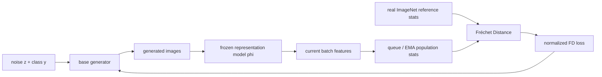

# FD-loss Reading Guide

论文全名是 **Representation Fréchet Loss for Visual Generation**。它属于 class-to-image / ImageNet generation 这条线，但核心贡献不是新 backbone，而是把 Fréchet Distance 从一个 evaluation metric 变成可训练的 post-training objective。

一句话：

```text
FD-loss = optimize distribution-level feature statistics directly,
          but estimate statistics over a large population
          while backpropagating only through the current batch.
```

## TL;DR

最重要的五句话：

1. 传统 FID / FD 是评估指标：生成 50k 图像，抽 Inception features，比较真实/生成分布的均值和协方差。
2. 这篇论文说：FD 也可以作为训练 loss，但不能只用当前 batch 估计 FD，因为 batch 太小、协方差太噪。
3. 他们的核心技巧是 decoupling：用 queue 或 EMA 维护大 population statistics，但只对当前 batch 的 features 反传梯度。
4. 他们不仅用 Inception，还用 SigLIP2、MAE、DINOv2、ConvNeXt、CLIP 等 representation spaces；默认强配置叫 FD-SIM，即 SigLIP2 + Inception + MAE。
5. 它主要用于 post-training：改进已有 one-step generators，也能把 multi-step generator repurpose 成 1-NFE generator。

## 这篇论文在 class-to-image 大类里的位置

```text
Class-to-Image Generation
  ├── model architecture papers
  ├── tokenizer / representation papers
  ├── acceleration / distillation papers
  └── training objective papers
        └── FD-loss
```

FD-loss 属于最后一类：训练目标 / 后训练方法。

## 推荐阅读顺序

- [Overview](00_overview.md)
- [Method and Loss](01_method_and_loss.md)
- [Data and Task Setup](02_data_and_task_setup.md)
- [Training Recipe](03_training_recipe.md)
- [Paper-Code Crosscheck](04_paper_code_crosscheck.md)
- [Reproducibility Gaps](05_reproducibility_gaps.md)

## 方法速写



## 高频问题

### 它真的是直接优化 FID 吗？

更准确地说，是优化 **Fréchet Distance in representation space**。当 representation model 是 Inception-v3 时，它就是 FID。论文更一般地叫 FD-loss，因为 representation 可以换成 Inception、MAE、SigLIP2、DINOv2 等。

### loss 是一个 scalar 吗？

是。FD 本身是一个 distribution-level scalar：

```math
\mathrm{FD}_{\phi} =
\|\mu_r-\mu_g\|_2^2+
\mathrm{Tr}(\Sigma_r+\Sigma_g-2(\Sigma_r\Sigma_g)^{1/2})
```

但它的梯度会通过当前 batch features 回传到当前 batch 生成图像，再回传到 generator 参数。

### 为什么不能直接用当前 batch 算 FID？

因为 FD 需要估计 feature distribution 的均值和协方差。比如 Inception feature 是 2048 维，用 batch size 1024 估计完整协方差已经很不稳定；更小 batch 会更糟。论文实验也显示 `queue_size=0` 会让结果比 base model 更差。

### 它和 GAN / distillation 的区别是什么？

它不训练 discriminator，也不需要 teacher model 给 per-sample target。它只让生成分布的 feature mean/covariance 靠近真实图像分布。

