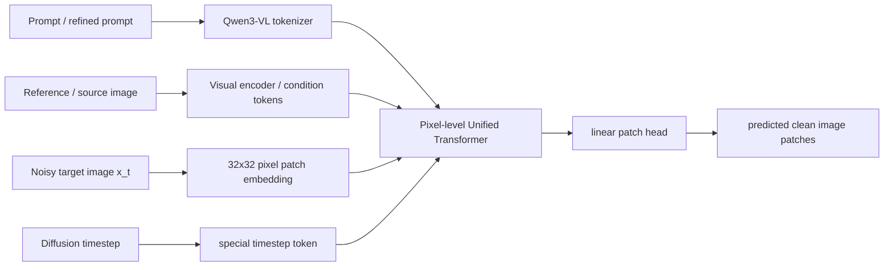
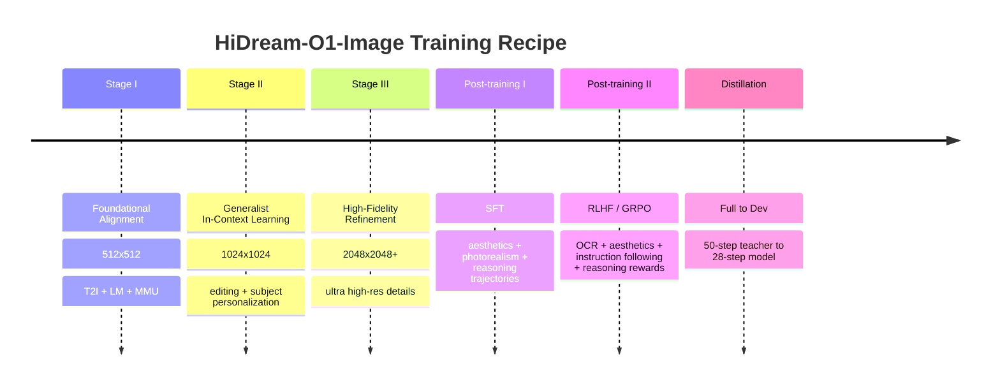

# HiDream-O1-Image Reading Guide

HiDream-O1-Image 的目标是把文本、条件图像、待生成图像的 noisy pixels 放进同一个 decoder-only Transformer 里，直接在 pixel space 做生成。它最醒目的主张是：

```text
raw pixels + text tokens + condition tokens
  -> Pixel-level Unified Transformer
  -> clean image patch prediction
```

也就是说，它不是 Stable Diffusion / FLUX 那种“VAE latent + external text encoder + DiT”的范式，而是更接近一个原生统一的 multimodal LLM / diffusion hybrid。

## TL;DR

最重要的四句话：

1. HiDream-O1-Image 是 pixel-space unified generation model：目标图像不经过 VAE latent，而是被切成 32×32 raw pixel patches。
2. 8B 版本初始化自 Qwen3-VL-8B-Instruct，所以不是 from scratch；它继承了 Qwen3-VL 的语言/多模态理解能力。
3. 它没有 SenseNova-U1 那种显式 MoT 双流参数解耦；代码里更核心的是 hybrid attention：text/condition token 保持 causal，generation token 做 full attention。
4. 模型输出不是直接预测 noise，而是在代码采样路径里预测 clean image patch `x0`，再换算成 velocity 给 scheduler 更新。

## 架构速写



## 训练时间线



## 本论文笔记

- [Overview](00_overview.md)
- [Model Architecture](01_model_architecture.md)
- [Data Construction](02_data_construction.md)
- [Training Recipe](03_training_recipe.md)
- [Paper-Code Crosscheck](04_paper_code_crosscheck.md)
- [Reproducibility Gaps](05_reproducibility_gaps.md)

## 高频问题

### 它和 SenseNova-U1 一样是双 stream 吗？

不完全一样。SenseNova-U1 的核心是 Native MoT：understanding stream 和 generation stream 在 block 内部有显式参数解耦。HiDream-O1-Image 的公开代码更像是在一个 Qwen3-VL decoder stack 里，通过 token type 和 attention mask 让 AR tokens causal、generation tokens full-attention。

### 它的 target image token 是怎么来的？

代码里 target image 先被加噪/采样得到当前状态 `z`，然后按 32×32 patch 切开，经 `BottleneckPatchEmbed` 投到 hidden size。每个 token 覆盖一个 32×32 RGB patch。

### timestep 怎么注入？

不是给所有 visual tokens 加一个 AdaLN time embedding，而是把 diffusion timestep 编码成一个特殊 token：`<|tms_token|>` 的 embedding 会被 `TimestepEmbedder(t)` 替换。

### 模型预测 noise 还是 clean image？

论文说 generation head maps output tokens back to clean image patches；代码里 `x_pred` 也被当作 clean image prediction 使用，然后计算：

```python
v = (x_pred - z) / sigma
model_output = -v
```

所以采样时实际送给 scheduler 的是从 clean-image prediction 换算出来的 velocity。

