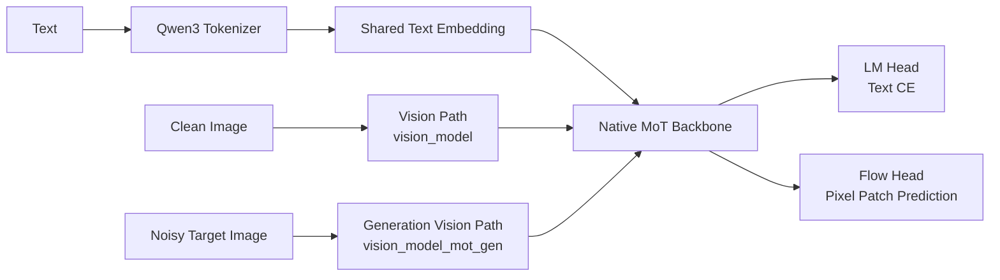
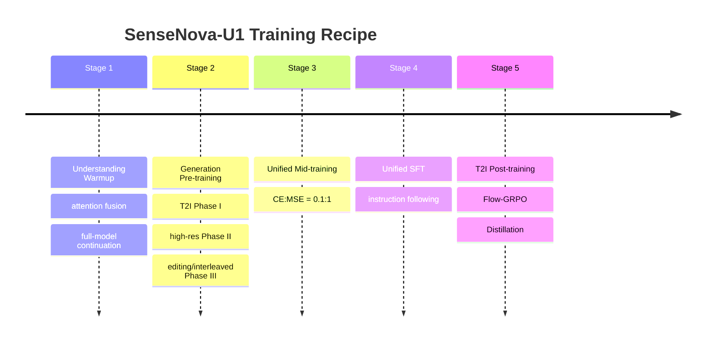

# SenseNova-U1 Reading Guide

SenseNova-U1 是一个基于 NEO-unify 的 native unified multimodal model。它的核心目标是把视觉理解、文本生成、图像生成、图像编辑和图文交错生成放到一个端到端架构里，而不是继续依赖 separate vision encoder 和 VAE latent decoder。

## TL;DR

```text
pixels + words
  -> near-lossless visual/text interface
  -> Native Mixture-of-Transformers backbone
  -> LM head for text
  -> pixel-space flow head for image
```

最重要的三句话：

1. 它和 TUNA-2 一样去掉 pretrained VE 和 VAE，但核心架构更强调 MoT stream decoupling。
2. 论文说的 32×32 visual token，在代码里来自 `patch_size=16` 和 `downsample_ratio=0.5` 的 2×2 merge。
3. `8B-MoT` 不是全模型总参数 8B；它大约是 8B understanding transformer + 8B generation transformer + 共享 text embedding/lm_head。

## 架构概览



## 训练时间线



## 本论文笔记

- [Overview](00_overview.md)
- [Model Architecture](01_model_architecture.md)
- [Data Construction](02_data_construction.md)
- [Training Recipe](03_training_recipe.md)
- [Paper-Code Crosscheck](04_paper_code_crosscheck.md)
- [Reproducibility Gaps](05_reproducibility_gaps.md)

## 高频问题

### 为什么代码里 `patch_size=16`，论文却说 32×32 patch？

因为代码先用 16×16 patch embedding，然后通过 `downsample_ratio=0.5` 对 2×2 patch 做合并。所以最终一个 visual token 覆盖：

```text
16 * 2 = 32
```

### MoT 和 MoE 是一回事吗？

不是。MoT 是 “Mixture-of-Transformers”，这里更强调 understanding stream 和 generation stream 的 Transformer 参数解耦。MoE 是专家 FFN 的稀疏路由机制。SenseNova-U1-A3B 同时用了 MoT 和 MoE。

### SenseNova-U1 和 TUNA-2 最核心区别是什么？

TUNA-2 更像一个 Qwen decoder 加 pixel embedding / flow head。SenseNova-U1 则在 Transformer 内部做 stream-wise 参数解耦：clean understanding tokens 和 noisy generation tokens 在每层里走不同的 norm / FFN / experts。

