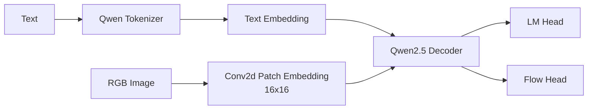

# TUNA-2 Reading Guide

TUNA-2 是一个 encoder-free / VAE-free 的 unified multimodal model。它把图片直接变成 pixel patch embeddings，并让这些 image tokens 和 text tokens 一起进入 Qwen2.5 decoder。

## TL;DR

```text
text:
  Qwen tokenizer -> text embeddings

image:
  raw RGB pixels -> 16x16 patch embedding

unified sequence:
  text tokens + image patch tokens
  -> Qwen2.5 decoder
  -> LM head for text
  -> flow head for image
```

## 架构概览



## 本论文笔记

- [Overview](00_overview.md)
- [Model Architecture](01_model_architecture.md)
- [Data Construction](02_data_construction.md)
- [Training Recipe](03_training_recipe.md)
- [Paper-Code Crosscheck](04_paper_code_crosscheck.md)
- [Reproducibility Gaps](05_reproducibility_gaps.md)

## 和 SenseNova-U1 的快速对照

| Dimension | TUNA-2 | SenseNova-U1 |
|---|---|---|
| Vision encoder | removed | removed |
| VAE | removed | removed |
| Visual token | 16×16 pixel embedding | effective 32×32 token |
| Backbone | Qwen2.5 decoder | Qwen3-style Native MoT |
| Generation head | flow head with attention blocks | MLP / pixel flow head |
| Stream decoupling | weaker / simpler | explicit understanding vs generation streams |

