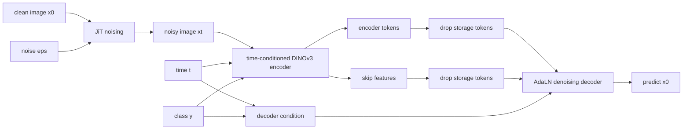

# DINOv3 + JiT Denoising Generation Project

这不是一篇已经定稿的论文笔记，而是当前研究项目的方法快照。目标是把一个 DINOv3-style SSL encoder 改造成更适合 pixel-space generation 的 representation backbone，然后在下游接一个 denoising decoder 做 ImageNet class-to-image generation。

一句话：

```text
pretrain a time-conditioned DINOv3 encoder with SSL + JiT denoising,
then finetune it as the conditioning encoder for a pixel-space denoising decoder.
```

## TL;DR

当前主线可以压缩成五点：

1. 预训练阶段基于 DINOv3 ViT encoder，引入 timestep conditioning，让 encoder 在 SSL 表征学习之外也接触 JiT-style noisy image denoising 语义。
2. 下游生成阶段不把 encoder 当成 frozen feature extractor，而是让 noisy image `x_t` 进入 pretrained encoder，再把 encoder tokens 和 skip features 交给 denoising decoder。
3. decoder 当前 preferred route 是 skip-connected AdaLN decoder：保留 time/class/CLS/patch tokens，去掉 storage tokens。
4. conditioning 设计仍在扩展中：当前路线支持多个 time tokens 和 class tokens，但 decoder AdaLN 的 time embedder 与 encoder time embedder只做参数初始化对齐，不做硬共享。
5. 已验证经验：generation finetune 阶段必须关闭 drop path。Drop path 会扰动 encoder-to-decoder condition / skip 路径，是背景噪点和训练失败的主要原因之一。

## 当前页面

- [Overview](00_overview.md)
- [Pretraining Recipe](01_pretraining_recipe.md)
- [Finetuning Architecture](02_finetuning_architecture.md)
- [Conditioning Design](03_conditioning_design.md)
- [Ablation Log and Open Questions](04_ablation_log.md)

## 方法速写



## 当前 preferred route

```text
Pretrain:
  DINOv3 SSL encoder
  + time conditioning
  + JiT-style denoising auxiliary / consistency objective

Finetune:
  noisy image -> pretrained encoder
  encoder output sequence -> remove storage tokens
  decoder input sequence includes time/class/CLS/patch tokens
  skip connections enabled
  multi time/class tokens supported
  decoder positional embedding disabled by default
  drop_path_rate = 0.0
```

## 读这个项目时最容易混淆的点

### 它不是 VAE latent diffusion

当前路线是 pixel-space generation。encoder 输入是 noisy image patches，而不是 Stable Diffusion VAE latent。

### Encoder 不是只提供一个 global condition

encoder 的输出 sequence 和 intermediate skip features 都会进入 decoder。也就是说，encoder 既是 representation model，也是 denoising decoder 的 token-level condition provider。

### Time token 和 decoder AdaLN time embedding 不是同一套参数

当前实现中 decoder `cond_embedder` 从 encoder `t_embedder` 拷贝初始化，但训练时是独立参数。这个设计避免 encoder time token 和 decoder AdaLN condition 被硬绑定。

### Storage tokens 不进入 decoder

DINOv3 的 storage/register tokens 对 SSL 预训练有用，但 generation decoder 当前只保留 time/class/CLS/patch tokens。storage tokens 会在主 decoder sequence 和 skip path 中都被切掉。

### Drop path 在 finetune 阶段关闭

这是当前最明确的实验结论之一。generation finetune 中 encoder-to-decoder condition 必须稳定，drop path 会随机扰动这些路径。
